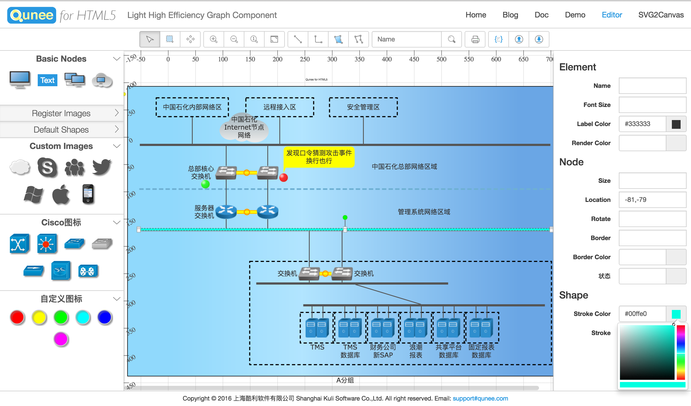
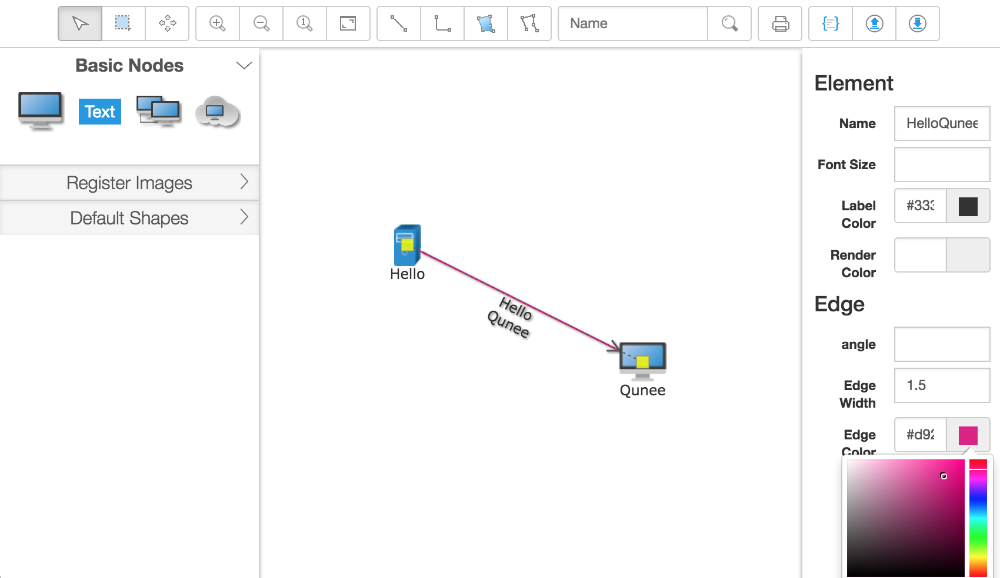

#拓扑图编辑器介绍

[Graph.Editor](https://github.com/samsha/graph.editor)

[在线演示](http://demo.qunee.com/editor/)

Graph.Editor是一款基于HTML5技术的拓补图编辑器，采用[jquery](http://jquery.com)插件的形式，是[Qunee图形组件](http://qunee.com)的扩展项目

数据可视化是一件有趣的工作，冰冷的数据变成美观的图形，如同命令行之于Mac OS X图形界面的，传统的图形组件以图表（Chart）居多，不少优秀的开源或者商业的作品，
比如d3js, echarts, highcharts，而拓扑图、流程图组件相对少一些，知名的有yfiles，本项目则基于Qunee图形组件，是Qunee的扩展项目，旨在为客户提供可供扩展的拓扑图编辑工具，
提供拓扑图展示、编辑、导出、保存等功能，此外本项目也是学习HTML5开发，构建WebAPP项目的参考实例。

>注意：本项目内核使用Qunee for HTML5，Qunee本身是一个商业产品，默认仅限本机（localhost）使用，非商业用途可以申请免费授权，商业用途请购买相应授权，官网：[qunee.com](http://qunee.com/)

##在线演示：

请访问此地址查看效果：[http://demo.qunee.com/editor/](http://demo.qunee.com/editor/)




##入门示例

Hello Graph.Editor
```
<!DOCTYPE html>
<html>
<head>
    <meta charset="UTF-8">
    <title>Hello Qunee</title>
    <link rel=stylesheet href=http://demo.qunee.com/editor/libs/bootstrap/css/bootstrap.css>
    <link rel=stylesheet href=http://demo.qunee.com/editor/libs/graph.editor/graph.editor.css>
</head>
<body class="layout">
<div id="editor" data-options="region:'center'"></div>
<script src="http://demo.qunee.com/editor/libs/js.js"></script>
<script src="http://demo.qunee.com/lib/qunee-min.js?v=1.8"></script>
<script src="http://demo.qunee.com/editor/libs/graph.editor/graph.editor.js"></script>
<script>
    $('#editor').graphEditor({callback: function(editor){
        var graph = editor.graph;
        var hello = graph.createNode("Hello", -100, -50);
        hello.image = Q.Graphs.server;
        var qunee = graph.createNode("Qunee", 100, 50);
        var edge = graph.createEdge("Hello\nQunee", hello, qunee);
        graph.moveToCenter();
    }});
</script>
</body>
</html>
```
编辑器的基本示例相比Hello Qunee要复杂些，除了[Qunee](http://qunee.com)类库外，还用到了一些第三方组件：[jquery](http://jquery.com), [bootstrap](http://getbootstrap.com), [layout.border](https://github.com/samsha/layout.border),
此外就是[Graph.Editor](https://github.com/samsha/graph.editor)自身的类库，这里我们引用在线的js和css

实际代码部分，采用了jquery的写法，如下:

```
$('#editor').graphEditor({
    callback: 回调函数,
    data: json数据地址,
    images: 拖拽图标信息
})
```
本例中，通过回调函数获取editor.graph对象，并创建了两个节点和一条连线

###运行效果


更多用法请查看其他demo和代码

##编辑器交互快捷键说明v

shift：按住此键拖拽节点，或者是从toolbox中拖拽创建节点，可以将节点拖入到分组内

shift：按住此键，按图标实际比例调整节点大小

方向键：移动画布

ctrl / commond + 方向键：移动选中图元的坐标，微调

dblclick 空白处：缩放画布到整个窗口

delete：删除当前选中的图元

ctrl / commond + S：导出当前画布图片

ctrl / commond + A：全选图元

ctrl / commond, 按住此键可以多选图元

ESC：取消全选

#准备工作

项目用到nodejs，~~使用bower包管理(v2.5版本改成了直接引用相关js文件)，~~用到Gulp相关的插件打包和发布

本项目使用以下工具：

* 安装nodejs
~~* 安装bower - 包管理~~
* 安装Gulp - 任务自动管理工具

##开始开发环境

切换到项目目录，然后运行下面的命令，完成开发环境的安装

>npm install

##前端第三方包

用到[jquery](http://jquery.com), [bootstrap](http://getbootstrap.com), [layout.border](https://github.com/samsha/layout.border), [bootstrap-colorpicker](https://github.com/mjolnic/bootstrap-colorpicker)

~~>bower install~~

##项目结构

项目主要代码在app目录，其中脚本代码在app/src/内，
```
app/
    --src/
        --common/  编辑器扩展插件
            --Exportpane.js 图片导出模块
            --JSONSerializer.js  数据序列化模块
            --PopupMenu.js  右键菜单模块
            --Toolbar.js  工具栏模块
            --PropertyPane.js  属性面板模块
            --ToolBox.js  左侧工具箱模块
            --GridBackground.js  网格背景模块
            -- ...  others
        --images/
        --graph.editor.js  拓扑图编辑器插件
        --graph.editor.css
    --libs/  第三方类库
    --scripts/  示例脚本
    --images/  示例资源
    --data/  示例资源
    --index.html  编辑器主页面
    --demo.html  编辑器插件示例
    -- ... other demos
dist/ 输出目录
demos/  使用在线editor类库的示例
node_modules/ 开发环境相关包目录，运行npm install后自动生成
... 其他文件(包含一些后台相关的尚未完成的代码,可能你没法直接使用,仅作为参考,可以忽略)
```

##编辑运行

开发过程中直接运行app中的html文件即可，不需要gulp打包，所有的.html文件都可以直接在IDE中运行，有一些动态加载json数据的可能需要web服务器部署访问

##编译打包

>gulp

输出目录结构
```
dist/
    data/
    images/
    libs/
        bootstrap/  第三方类库bootstrap样式和资源目录
        graph.editor/  graph.editor类库
            images/
            graph.editor.css
            graph.editor.js
        js.js  第三方类库（jquery, bootstrap, layout.border）
    scripts/
    styles/
    index.html
```
编辑器主要的类库文件位于libs/graph.editor/, 第三方类库（jquery, bootstrap, layout.border）位于libs/js.js，bootstrap样式和资源目录位于libs/bootstrap/

#其他说明

项目中包含一些后台相关的尚未完成的代码,可能你没法直接使用,仅作为参考,可以忽略